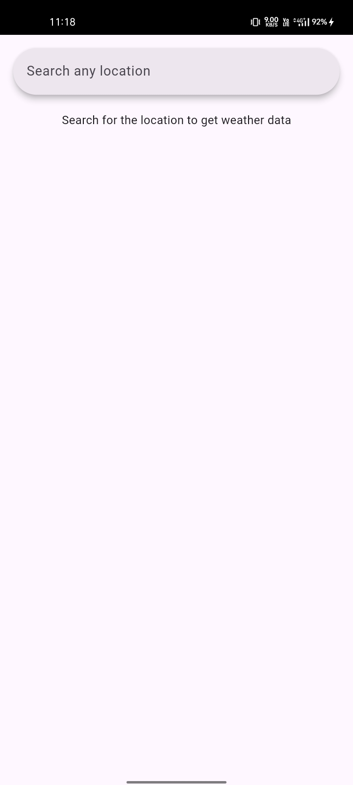
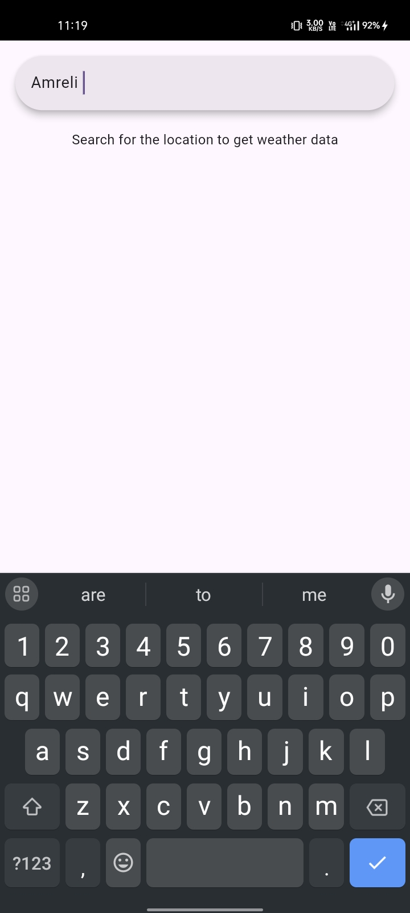
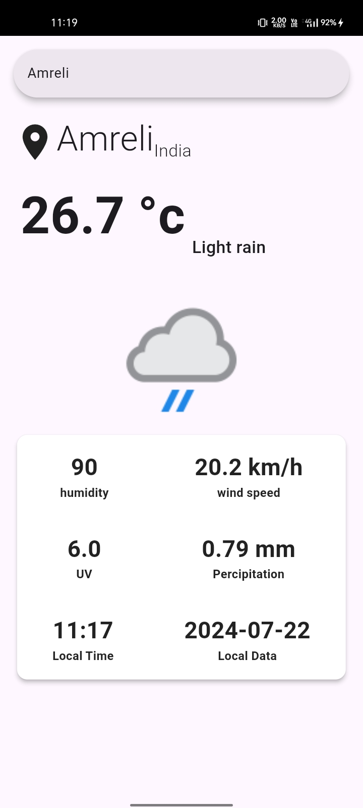

# Weather App

A simple weather application built with Flutter that provides current weather information for any location.

## Features

- Get current weather information based on the user's location.
- Search for weather information by city name.
- Display weather details including temperature, humidity, wind speed, and weather conditions.
- Beautiful UI with weather icons and animations.

## Screenshots





## Getting Started

### Prerequisites

- Flutter SDK: [Install Flutter](https://flutter.dev/docs/get-started/install)
- A code editor like VS Code or Android Studio

### Installation

1. **Clone the repository:**
   ```sh
   git clone https://github.com/yourusername/weather_app.git
   cd weather_app
